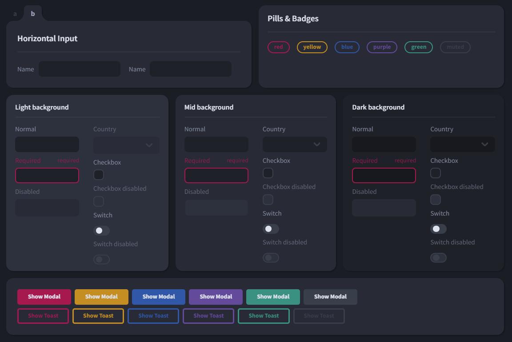

# Skinned UI - WIP

A headless UI library with optional dark theme styling for Svelte. Simple. Made for Tailwind CSS. Customizable through CSS.

Check out the [`example page`](https://dmmarodin.github.io/Skinned-UI/).

## images

## Components

Currently there are the following components available:

- Buttons
- Text Inputs
- Checkbox
- Switch
- Cards
- Tab panel
- Badges
- Modals with controls
- Toast notifications

## Roadmap

- Documentation and examples for each component.
- Masking and validation for different input types.
- Radio buttons.
- Promise-based API for toast control.

## Usage

Not yet available as a package. Coming soon.
